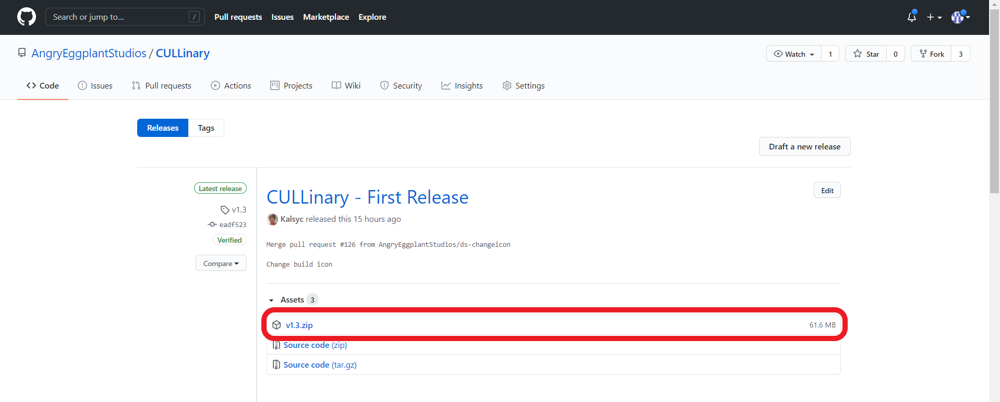
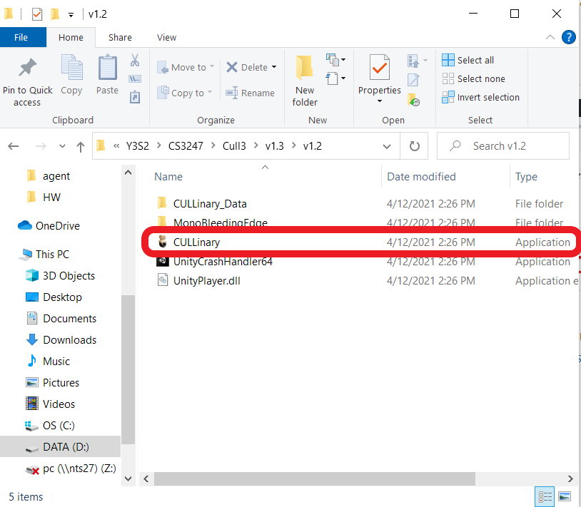
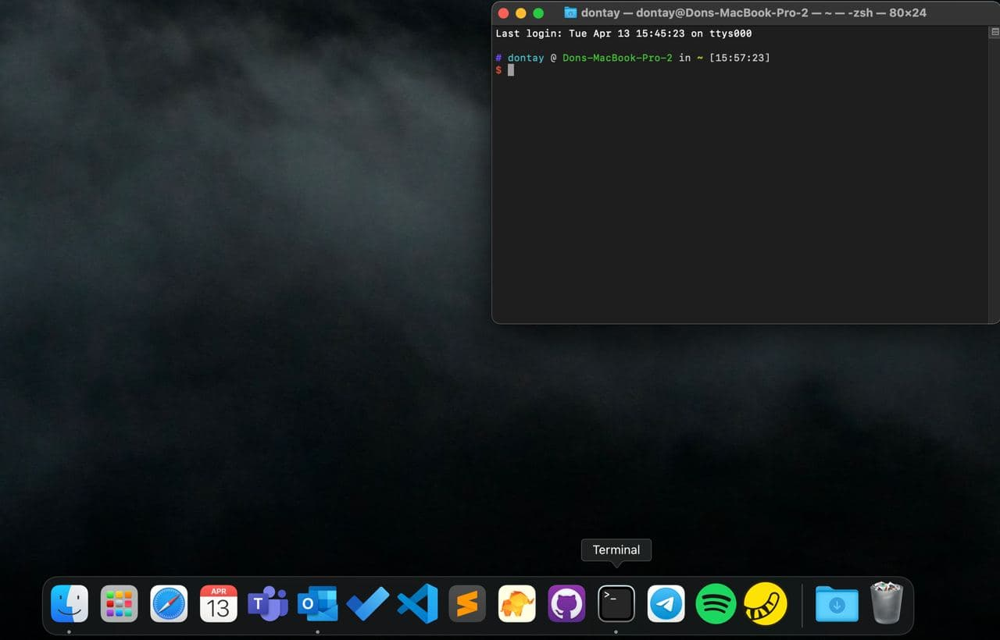
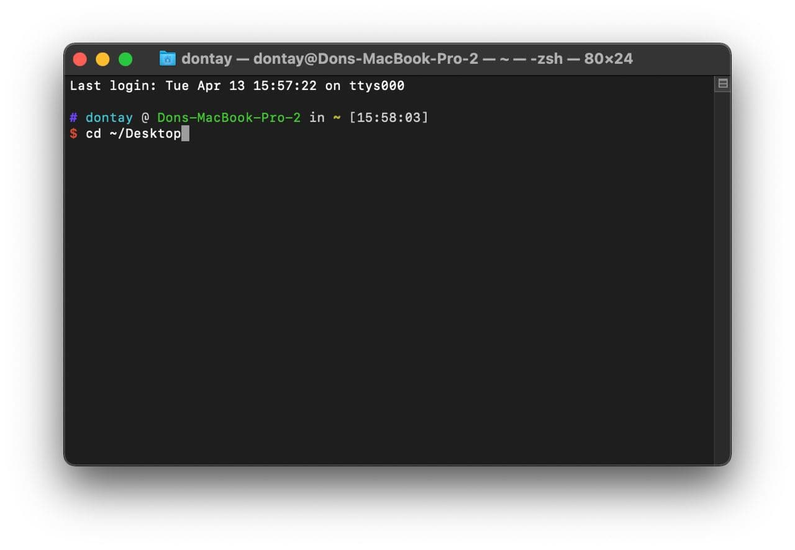
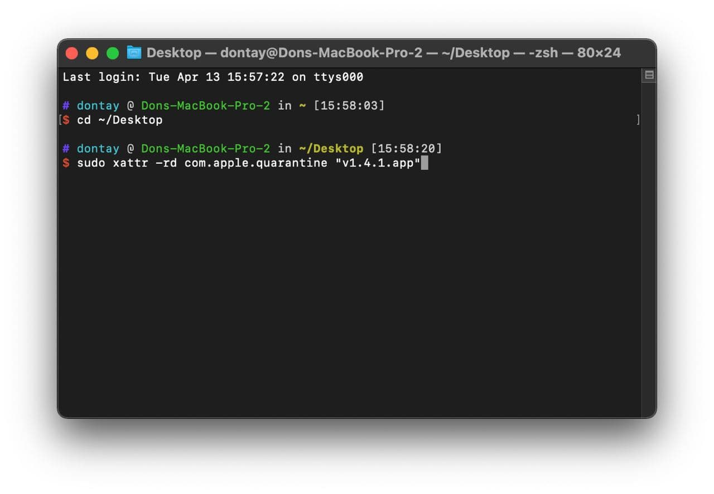
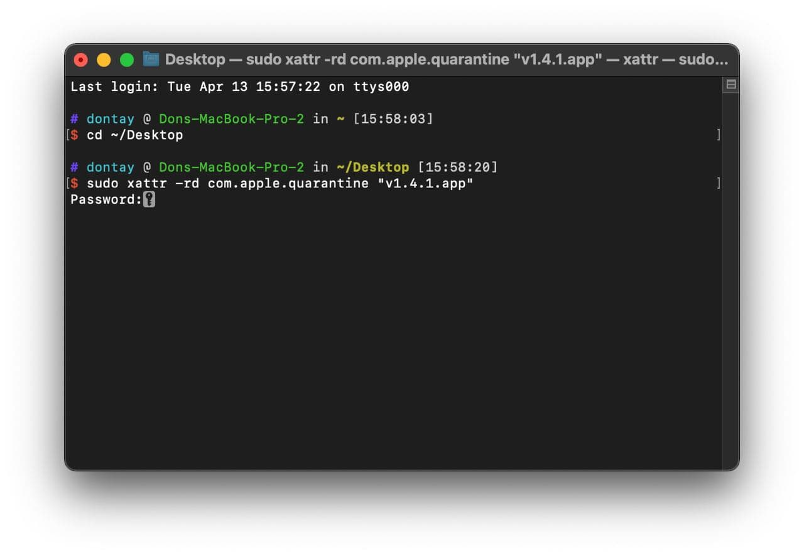

# CULLinary

Developed by Team Angry Eggplant for NUS CS3247: Game Development using Unity 2020.2.3f1

 

CULLinary is a crossover game between a Dungeon Crawler and a Restaurant Management Simulator where you cook what you cull!

You are an owner of a humble restaurant in your hometown. Recently, chemical waste from the nearby factories have caused the flora and fauna to mutate into monsters.

As a result, the number of visitors to the town is declining rapidly, running your restaurant out of business. Now your job is to kill off the monsters, grow your restaurant so that you can attract visitors back to your town and make it great again!

Our 18th STePS (AY20/21 S2) Submission: https://uvents.nus.edu.sg/event/18th-steps/module/CS3247/project/7

Trailer: https://www.youtube.com/watch?v=SKpQ_maMmHE

## Contents
  * [System Requirements](#system-requirements)
  * [Download Instructions](#download-instructions)
      - [Windows10](#Windows10)
      - [MacOS](#MacOS)
      - [Linux](#Linux)
  * [Control Instructions](#control-instructions)
      - [General](#general)
      - [Restaurant](#restaurant)
      - [Dungeon](#dungeon)

## System Requirements
- Space required: 200MB
- RAM: 8GB RAM (Recommended for optimal performance)
- Graphics: Nvidia GeForce 1050 or Higher (Recommended for optimal performance)
- Platforms Supported: Windows10, MacOS, Linux (Tested on Ubuntu 18.04)

## Download Instructions

### Windows10
  
1) Download the latest Windows10 release [here](https://github.com/AngryEggplantStudios/CULLinary/releases)  
2) Unzip the file.  
  
3) Click on CULLinary icon to start the game.  

### MacOS

1) Download the latest MacOS release [here](https://github.com/AngryEggplantStudios/CULLinary/releases)  
  
2) Unzip file and place the `v1.4.1.app` on Desktop (Remember the filepath to CULLinary, but the instructions will use Desktop as an example)  
  
3) Open Terminal (Search Terminal on your MacOS)  
  
4) Input `cd ~/Desktop` onto Terminal and hit Enter.  
  
5) Input `sudo xattr -rd com.apple.quarantine "v1.4.1.app"` onto Terminal and hit Enter  
  
6) Enter your MacBook password when prompted on Terminal and hit Enter.  
7) You should be able to run CULLinary now!  

### Linux
1) Download the latest Linux (.x86_64 file) release [here](https://github.com/AngryEggplantStudios/CULLinary/releases)  
2) Unzip the file.  
3) Double-click `v1.4.x86_64` to launch the game!  

## Control Instructions

#### General
* WASD - Move
* ESC - Pause
* I - Inventory
* R - Recipes
* Q - Player Stats

#### Restaurant
* F - Interact / Talk to Customer
* Scroll - Zoom In/Out

#### Dungeon
* F - Interact
* Hold L Shift - Run
* Left Click - Melee Attack
* Right Click - Ranged Attack 
